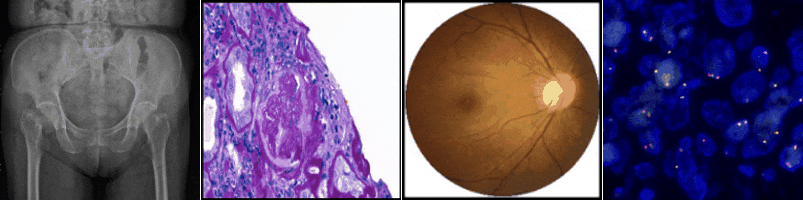

<h1 align="center">Welcome to CIFLAB</h1>
<h3 align="center">An enthusiastic team at NYCU focuses on medical image analysis and bioinformatics</h3>

<p align="center">
  
</p>


# Description

### Medical image analysis
Our laboratory cooperates with physicians in many hospitals to develop algorithms suitable for various medical images. The images we analyzed include X-ray, CT, endoscopic, fundus image and pathological image. Current research would focus on auxiliary learning, federated learning, semi-supervised learning and graph convolutional networks.
### Bioinformatics
We focus on adopting various AI models for pharmacogenomics analysis. Here different cancer omics data (expression, mutation, copy number, etc.), and the information of drug chemical/molecular fingerprints and biological pathways are properly encoded to extract useful characteristics for predicting drug response and investigating drug repositioning.


# Recently research topics

- **Trauma detection through X-ray**
  
  This project focus on X-ray image classification and lesion detection. Our final goal is to develop a comprehensive model which can detect trauma in any type of X-ray.

- **STAS detection**

  Develop a computer-aided diagnostic tool which can help pathologists find STAS in pathology images based on deep learning object detection models.

- **Glomerulus segmentation**

- **Diabetic retinopathy detection through fundus**

  This study aims to evaluate the effectiveness of semi-supervised learning in medical imaging by analyzing diabetic retinopathy. Some visualization method such as saliency map has been adopted for the second confirmation.

# Information 
Lab publication: <https://github.com/NYCUciflab/Publication>    

Email: ```ifchung@nycu.edu.tw```


<p align="left">
</p>

<h3 align="left">Languages and Tools:</h3>
<p align="left"> <a href="https://www.docker.com/" target="_blank" rel="noreferrer">  </a> <a href="https://git-scm.com/" target="_blank" rel="noreferrer">  </a> <a href="https://www.linux.org/" target="_blank" rel="noreferrer">  </a> <a href="https://opencv.org/" target="_blank" rel="noreferrer">  </a> <a href="https://www.python.org" target="_blank" rel="noreferrer">  </a> <a href="https://pytorch.org/" target="_blank" rel="noreferrer">  </a> <a href="https://www.qt.io/" target="_blank" rel="noreferrer">  </a> <a href="https://scikit-learn.org/" target="_blank" rel="noreferrer">  </a> <a href="https://www.tensorflow.org" target="_blank" rel="noreferrer">  </a> </p>
